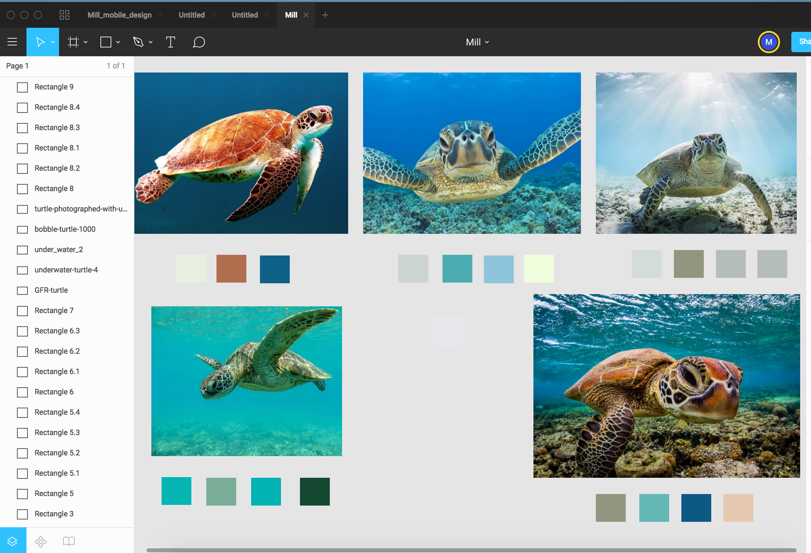

# Personal Portfolio Project- Amila Daulagala

The objectives of the Personal Portfolio Project is demonstrate my css and html abilities to prospective employers.

## Authors

Amila Daulagala

# Developement Process and Documentation

## Ideas

I appreciate simplicity. Therefore my first thoughts were designing a very simple layout with light colors. 

- **"Light colors "** 
I prefer light colors. My favorites colors are sky blue and Cyan color. My initial brainstorm i came up a color theme using 
Sea turtles. I found few images and try make color palettes using sea turtules and the sea.

(Sea turtles)

- After initial brainstorm i found few colors which i can use for the portfolio project.

(Sea turtles color palette)

- The next step was selecting a color from palette.
 i selected the best and my favourite color from above color paletts.

**"NYANZA"**
- I selected **"NYANZA"** **"#EFFDDD "** as my primary color for the personal portfolio project.

- Then i try to draw initial sketch using Figma tool. 

## Initial sketch
 
(Initial sketch)

- The sketch was very different from what i was expected. It looked old school and less elegant.

## Planning

I looked back and thought about a different background color. My intial theme's background color was light background color. But it seems like less appealing.

- I did Generate few matching dark colors to my favourite color **"NYANZA"** **"#EFFDDD"** using a color Generate app. 

  

- My next step was trying out above dark colors as a background color.

 ### Selecting Background color

 - I did match Background color with text color using Figma. 

 

- It was lucky to have couple of best combinations which i can manipulate throughout the Personal Portfolio Project.

 The colors i selected were : 
- NYANZA **"#EFFDDD"**
- DARK IMPERIAL BLUE **"#114A66"**
- DEEP GREEN-CYAN TURQUOISE **"#0D5C63"**
- WHITE **"#FFFFFF"**
- MELLOW APRICOT **"#F8BD7F"**

 After few hours of struggling with color matching i moved on to Font selection process.

### Font styles Selection

- I researched google fonts website and selected few fonts.

- Early in the planning phase, i had couple of font styles in my mind but i have changed the mind to folowing font styles. 

- Roboto , Lato , Merriweather Sans 

## Designing the Personal Portfolio

I moved to the desinging stage of the project. My initial sketch wasn't helpful at all. Therefore i had to brainstorm again. i was looking for an inspiration.

- I start with mobile version of the personal portfolio and selected iphone 8 view on Figma tool.

- Then i came up with the following design for mobile version.

