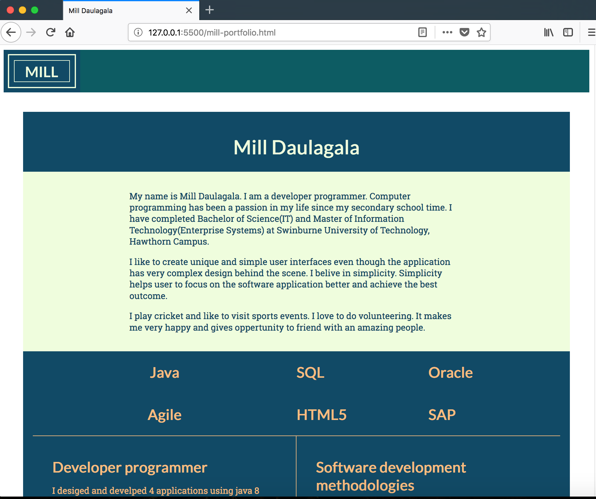

# Personal Portfolio Project- Amila Daulagala

The objectives of the Personal Portfolio Project is demonstrate my css and html abilities to prospective employers.

## Authors

Amila Daulagala

# Developement Process and Documentation

## Ideas

I appreciate simplicity. Therefore my first thoughts were designing a very simple layout with light colors. 

- **"Light colors "** 
I prefer light colors. My favorites colors are sky blue and Cyan color.As a result of my initial brainstorm i came up a color theme using Sea turtles. I found few images and try make color palettes using sea turtules and the sea.


(Sea turtles)

- After initial brainstorm i found few colors which i can use for the portfolio project.


(Sea turtles color palette)

- The next step was selecting a color from palette.
 i selected the best and my favourite color from above color paletts.

**"NYANZA"**
- I selected **"NYANZA"** **"#EFFDDD "** as my primary color for the personal portfolio project.

- Then i try to draw initial sketch using Figma tool. 

## Initial sketch
 
(Initial sketch)

- The sketch was very different from what i was expected. It looked old school and less elegant.

## Planning

I looked back and thought about a different background color. My intial theme's background color was light background color. But it seems like less appealing.

- I did Generate few matching dark colors to my favourite color **"NYANZA"** **"#EFFDDD"** using a color Generate app. 

  

- My next step was trying out above dark colors as a background color.

 ### Selecting Background color

 - I did match Background color with text color using Figma. 

 


- It was lucky to have couple of best combinations which i can manipulate throughout the Personal Portfolio Project.

 The colors i selected were : 
- NYANZA **"#EFFDDD"**
- DARK IMPERIAL BLUE **"#114A66"**
- DEEP GREEN-CYAN TURQUOISE **"#0D5C63"**
- WHITE **"#FFFFFF"**
- MELLOW APRICOT **"#F8BD7F"**

 After few hours of struggling with color matching i moved on to Font selection process.

### Font styles Selection

- I researched google fonts website and selected few fonts.

- Early in the planning phase, i had couple of font styles in my mind but i have changed the mind to folowing font styles. 

- Roboto , Lato , Merriweather Sans 


## Designing the Personal Portfolio

I moved to the desinging stage of the project. My initial sketch wasn't helpful at all. Therefore i had to brainstorm again. i was looking for an inspiration.

- I start with mobile version of the personal portfolio and selected iphone 8 view on Figma tool.

- Then i came up with the following design for mobile version.


### Second design

I wanted to try  differnt color combinations. After few attempts i found the following color combination.


### Third design

The following one is the thrid design.


- The third design looked better than the second one. Therefore i decided to go with the third design.

## Developing the Personal Portfolio

### Development ideas.

- Header (with mill logo)
- Main area (portfolio-head and css-grid for skills)
- aside (navigagtion area)
- social media liks (social area)

#### structure (CSS-grid) 

```
.mill-content {
    display: grid;
    grid-template-columns: 100%;
    grid-template-rows: auto;
    grid-template-areas:
    "main"
    "navigation"
    "social";
}
```

- The above layout for mobile view. I started with the mobile view. 


## Development phase.

#### stage one.

- I started with the mill-portfolio.html and added it to git. I was able to complete the first stage of mill-portfolio.html.

- The first html draft had the portfolio-title, intro, skill's titles and skill's body-(description of each skill i have), navigation-area and mill-footer.

- I had a look at the first html draft on mozilla firefox. The structure was clean and readable even without the css style. 


#### stage two.

- I have moved to the css part of the portfolio project. 

- I had 6 skills on the html page. i did design the css-grid in order to distribute the 6 skills titles and descripton evenly.
- My theme was old school table view using the latest css-grid and manipulate the skills titles to come together when it comes to larger screen.
- I wanted the title of each skill on top of the description on mobile view.


#### stage three.

## First mobile view.

The css-grid gave me hard time from the begining. it wasn't aligned what i was expected. After many attempts i was able to understand the basic css-grid concepts and behaviour.

- The next step was write the fonts and colors on css.
- I added the mill logo to the header. 

The first mobile view appered as following screen shot. 


## Second mobile view.

This is how the header with logo and introduction appear.


## Third mobile view. 

I love cricket and i included a svg of a cricket batsman to my portfolio page. 

 

- The batsman svg will be on aside when it comes to the larger screen.

## Larger screen view.

After satisfied look on mobile view i started the larger screen view. 

### Skill titles on one area.



### Cricketer on the aside.


- The above screen shows where the cricketer svg when it is on larger screen. 


## CSS-grid

- Few things about css grid. First of all it is an amazing concept.  I wasn't able to do this type of cool tricks with old school table layout while i was at the university. 

- I will be learning css-grid and use it whenever i can.


### css-grid manipulation

- I had difficulty of understanding the grid layout in the begining of the grid.
- The goal was to bring the skills titles to an one place on the top. 

- The following css did the trick. 

```
 .skill1-text {
        grid-column: 1/3;
        grid-row: 2/4;
        margin: auto;
    }

    .skill2-text {
        grid-column: 1/3;
        grid-row: 4/6;
        margin: auto;
    }

    .skill3-text {
        grid-column: 3/4;
        grid-row: 2/3;
        
    }
```

